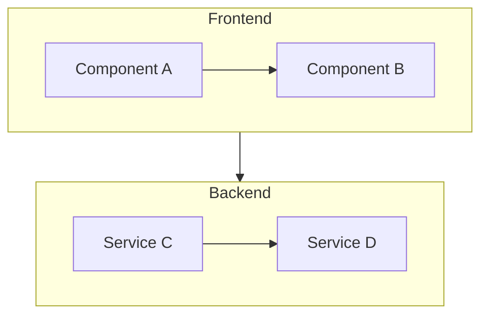
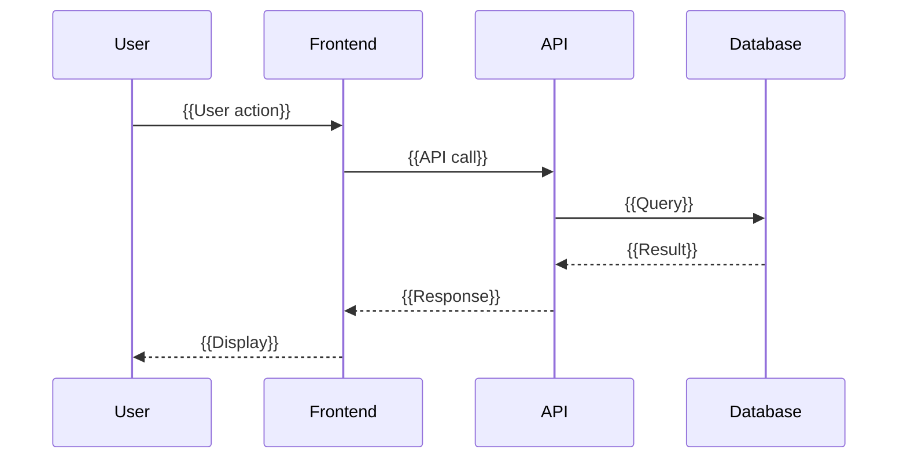
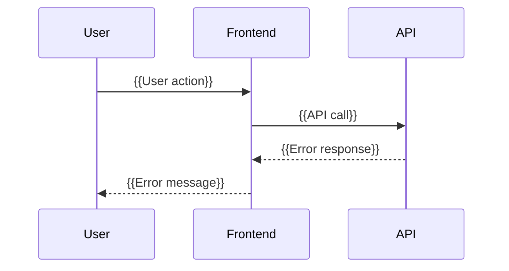
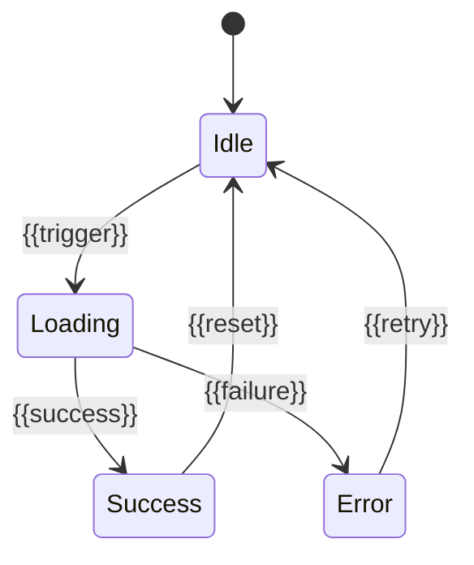
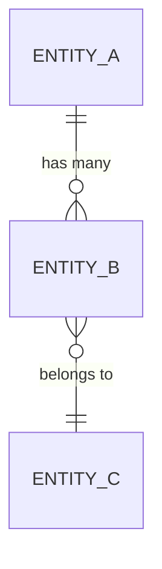

# Design: {{FEATURE_NAME}}

> **Phase**: 3/5 - Design  
> **Input**: [research.md](./research.md), [requirements.md](./requirements.md)  
> **Created**: {{DATE}}  
> **Status**: 🟡 Draft | 🟢 Approved

---

## Overview

{{Brief description of the technical approach and architecture}}

### Design Principles

1. **{{Principle 1}}**: {{e.g., Lightweight first — avoid heavy dependencies}}
2. **{{Principle 2}}**: {{e.g., Single source of truth — no duplicate state}}
3. **{{Principle 3}}**: {{e.g., Fail fast — validate early}}

---

## Architecture

### System Diagram



### Component Overview

| Component | Responsibility | File(s) | Covers REQs |
|-----------|---------------|---------|-------------|
| {{Component 1}} | {{What it does}} | `{{path/to/file}}` | REQ-001, REQ-002 |
| {{Component 2}} | {{What it does}} | `{{path/to/file}}` | REQ-003 |

---

## Sequence Diagrams

<!-- ACTION REQUIRED: Show key interaction flows -->

### Happy Path: {{Main Flow Name}}



### Error Path: {{Error Flow Name}}



---

## State Diagram

<!-- ACTION REQUIRED: If feature has state transitions, document them -->



| State | Description | Transitions |
|-------|-------------|-------------|
| Idle | {{Initial state}} | → Loading |
| Loading | {{Processing}} | → Success, Error |
| Success | {{Completed}} | → Idle |
| Error | {{Failed}} | → Idle |

---

## Component Details

### 1. {{Component Name}} (NEW)

<!-- ACTION REQUIRED: Define interface with actual types -->

```typescript
// {{path/to/file.ts}}
interface {{ComponentInterface}} {
  {{property}}: {{Type}};
  {{method}}(): {{ReturnType}};
}
```

**Why This Design**: {{Rationale for this approach}}

**Covers**: REQ-001, REQ-002

---

### 2. {{Component Name}} (MODIFY)

```python
# {{path/to/file.py}}
class {{ComponentClass}}:
    def __init__(self, {{param}}: {{Type}}):
        pass
    
    async def {{method}}(self) -> {{ReturnType}}:
        """{{Description}}"""
        pass
```

**Why This Design**: {{Rationale}}

**Covers**: REQ-003

---

## API Contract

<!-- ACTION REQUIRED: Define API interfaces if applicable -->

### Endpoints

| Method | Endpoint | Request | Response | Auth |
|--------|----------|---------|----------|------|
| POST | `/api/{{resource}}` | `CreateRequest` | `CreateResponse` | Bearer |
| GET | `/api/{{resource}}/:id` | - | `GetResponse` | Bearer |
| PUT | `/api/{{resource}}/:id` | `UpdateRequest` | `UpdateResponse` | Bearer |
| DELETE | `/api/{{resource}}/:id` | - | `204 No Content` | Bearer |

### Request/Response Schemas

```typescript
// POST /api/{{resource}}
interface CreateRequest {
  {{field1}}: string;
  {{field2}}: number;
}

interface CreateResponse {
  id: string;
  {{field1}}: string;
  {{field2}}: number;
  createdAt: string;
}

// Error Response (all endpoints)
interface ErrorResponse {
  error: {
    code: string;
    message: string;
    details?: Record<string, string>;
  };
}
```

---

## Data Models

### {{Entity Name}}

```typescript
interface {{EntityName}} {
  id: string;
  {{field1}}: {{Type}};
  {{field2}}: {{Type}};
  createdAt: Date;
  updatedAt: Date;
}
```

### Relationships



---

## Security Considerations

<!-- ACTION REQUIRED: Document security measures -->

| Concern | Mitigation | Implementation |
|---------|------------|----------------|
| {{Authentication}} | {{JWT validation}} | Middleware in `auth.ts` |
| {{Authorization}} | {{Role-based access}} | Guard in `rbac.ts` |
| {{Input Validation}} | {{Schema validation}} | Zod schemas |
| {{SQL Injection}} | {{Parameterized queries}} | ORM usage |
| {{XSS}} | {{Output encoding}} | React auto-escaping |
| {{CSRF}} | {{Token validation}} | Double-submit cookie |

### Sensitive Data Handling

| Data Type | Storage | Transmission | Access |
|-----------|---------|--------------|--------|
| {{Passwords}} | Hashed (bcrypt) | HTTPS only | Never logged |
| {{PII}} | Encrypted | HTTPS only | Audit logged |
| {{Tokens}} | Memory only | HTTPS only | Short-lived |

---

## Design Decisions (ADR-style)

### Decision 1: {{Topic}}

**Context**: {{Problem statement}}

**Decision**: {{Chosen approach}}

**Why**: 
- {{Reason 1}}
- {{Reason 2}}

**Alternatives Rejected**:
| Alternative | Rejected Because |
|-------------|------------------|
| {{Option A}} | {{Reason}} |
| {{Option B}} | {{Reason}} |

**Trade-offs**:
- ✅ {{Benefit}}
- ⚠️ {{Drawback to accept}}

---

## Error Handling

| Error Type | HTTP Code | Error Code | Handling Strategy |
|------------|-----------|------------|-------------------|
| {{Validation}} | 400 | `VALIDATION_ERROR` | Return field errors |
| {{Not Found}} | 404 | `NOT_FOUND` | Return resource type |
| {{Unauthorized}} | 401 | `UNAUTHORIZED` | Redirect to login |
| {{Rate Limit}} | 429 | `RATE_LIMITED` | Return retry-after |
| {{Server Error}} | 500 | `INTERNAL_ERROR` | Log + generic message |

---

## Testing Strategy

### By Requirement Priority

| Priority | Test Type | Coverage |
|----------|-----------|----------|
| P1 (MVP) | Unit + Integration | 100% |
| P2 | Unit | 80%+ |
| P3 | Unit | Best effort |

### Test Plan

| Component | Test Type | Framework | Location |
|-----------|-----------|-----------|----------|
| {{Component 1}} | Unit | {{Vitest}} | `tests/unit/` |
| {{Component 2}} | Integration | {{Playwright}} | `tests/e2e/` |
| {{API}} | Contract | {{Supertest}} | `tests/api/` |

### Test Cases from Requirements

| REQ ID | Test Case | Type | Automated |
|--------|-----------|------|-----------|
| REQ-001 | {{Test description}} | Unit | ✅ |
| REQ-001 | {{Test description}} | Integration | ✅ |
| REQ-002 | {{Test description}} | E2E | ✅ |

---

## Files Summary

### Files to CREATE

| File | Component | Purpose | Est. Lines |
|------|-----------|---------|------------|
| `{{path/to/new.ts}}` | {{Component 1}} | {{Description}} | ~{{100}} |

### Files to MODIFY

| File | Changes | Risk | Backup Plan |
|------|---------|------|-------------|
| `{{path/to/existing.ts}}` | {{What changes}} | 🟢/🟡/🔴 | {{Revert commit}} |

---

## Integration Architecture

<!-- ACTION REQUIRED: Define exactly HOW to wire this feature into the existing system -->

### Entry Point Diagram

```mermaid
flowchart LR
    subgraph Existing["Existing System"]
        MAIN[main entry] --> ROUTER[Router/Registry]
        ROUTER --> EXISTING[Existing Features]
    end
    subgraph New["New Feature"]
        NEW_COMPONENT[{{FeatureComponent}}]
    end
    ROUTER -.->|"Add route/register"| NEW_COMPONENT
```

### Integration Points

| Integration Type | File to Modify | Specific Change | Location/Line |
|------------------|----------------|-----------------|---------------|
| Route Registration | `{{src/router/index.ts}}` | Add route `"/{{feature}}"` | After existing routes |
| Navigation Menu | `{{src/components/Menu.tsx}}` | Add menu item | `menuItems` array |
| Config/Feature Flag | `{{src/config/index.ts}}` | Add `FEATURE_{{NAME}}` | `features` object |
| Type Export | `{{src/types/index.ts}}` | Export new types | End of file |
| Service Registration | `{{src/services/index.ts}}` | Register service | Container setup |

### Integration Dependencies

| This Feature Needs | From Existing | How to Access |
|--------------------|---------------|---------------|
| {{Auth context}} | `{{src/contexts/AuthContext}}` | `useAuth()` hook |
| {{API client}} | `{{src/api/client}}` | Import directly |
| {{Config}} | `{{src/config}}` | `getConfig()` |

---

## Requirements Traceability

<!-- ACTION REQUIRED: Every REQ must map to at least one component -->

| REQ ID | Requirement | Component | API | Test Strategy |
|--------|-------------|-----------|-----|---------------|
| REQ-001 | {{Title}} | {{Component 1}} | `POST /api/x` | Unit + Integration |
| REQ-002 | {{Title}} | {{Component 1}} | `GET /api/x` | Unit |
| REQ-003 | {{Title}} | {{Component 2}} | - | Integration |

---

## Quality Self-Check

Before marking complete, verify:

- [ ] All REQ-XXX are mapped to components
- [ ] Sequence diagrams show happy path AND error path
- [ ] State diagram included (if stateful feature)
- [ ] API contract defined with request/response schemas
- [ ] Security considerations documented
- [ ] At least 2 alternatives were considered for major decisions
- [ ] Trade-offs are documented (both pros and cons)
- [ ] Mermaid diagrams render correctly
- [ ] File paths are specific (not generic)
- [ ] Error handling is defined with HTTP codes

---

## → Next Phase

**Output**: This design.md  
**Next**: tasks.md (Phase 4)  
**Handoff**: Ready for `ouroboros-tasks` agent
