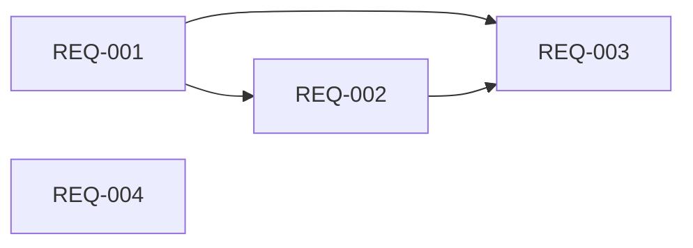

# Requirements: {{FEATURE_NAME}}

> **Phase**: 2/5 - Requirements  
> **Input**: [research.md](./research.md)  
> **Created**: {{DATE}}  
> **Status**: 🟡 Draft | 🟢 Approved

---

## Introduction

{{Brief description of the feature and the problem it solves}}

**Core Goals:**
1. {{Primary goal}}
2. {{Secondary goal}}
3. {{Tertiary goal}}

---

## Glossary

| Term | Definition |
|------|------------|
| {{Term 1}} | {{Project-specific definition}} |
| {{Term 2}} | {{Definition}} |

---

## Functional Requirements

<!-- 
  ACTION REQUIRED: 
  - Use EARS notation (WHEN/WHILE/IF-THEN/SHALL)
  - Each requirement must have P1/P2/P3 priority
  - Each requirement must have Independent Test
  - Each requirement must have Verified By
-->

### REQ-001: {{Requirement Title}} (Priority: P1) 🎯

**User Story**: As a {{role}}, I want {{capability}}, so that {{benefit}}.

**Why P1**: {{Explain why this is highest priority — MVP critical}}

**Depends On**: None | REQ-XXX

**Independent Test**: {{How to verify this requirement works on its own}}

**Verified By**: Unit Test | Integration Test | Manual QA | User Acceptance

**Acceptance Criteria** (EARS notation):
1. WHEN {{trigger}}, the System SHALL {{behavior}}
2. WHILE {{state}}, the System SHALL {{ongoing behavior}}
3. IF {{error condition}}, THEN the System SHALL {{error handling}}

---

### REQ-002: {{Requirement Title}} (Priority: P1)

**User Story**: As a {{role}}, I want {{capability}}, so that {{benefit}}.

**Why P1**: {{...}}

**Depends On**: REQ-001

**Independent Test**: {{...}}

**Verified By**: {{...}}

**Acceptance Criteria**:
1. WHEN {{trigger}}, the System SHALL {{behavior}}
2. IF {{condition}}, THEN the System SHALL {{fallback}}

---

### REQ-003: {{Requirement Title}} (Priority: P2)

**User Story**: As a {{role}}, I want {{capability}}, so that {{benefit}}.

**Why P2**: {{Important but not MVP-critical}}

**Depends On**: REQ-001, REQ-002

**Independent Test**: {{...}}

**Verified By**: {{...}}

**Acceptance Criteria**:
1. WHEN {{trigger}}, the System SHALL {{behavior}}

---

### REQ-004: {{Requirement Title}} (Priority: P3)

**User Story**: As a {{role}}, I want {{capability}}, so that {{benefit}}.

**Why P3**: {{Nice to have if time permits}}

**Depends On**: None

**Independent Test**: {{...}}

**Verified By**: {{...}}

**Acceptance Criteria**:
1. WHEN {{trigger}}, the System SHALL {{behavior}}

---

## Requirement Dependencies

<!-- ACTION REQUIRED: Map dependencies between requirements -->

| REQ ID | Depends On | Blocks |
|--------|------------|--------|
| REQ-001 | None | REQ-002, REQ-003 |
| REQ-002 | REQ-001 | REQ-003 |
| REQ-003 | REQ-001, REQ-002 | None |
| REQ-004 | None | None |

---

## Edge Cases

<!-- ACTION REQUIRED: Identify boundary conditions and error scenarios -->

| ID | Scenario | Expected Behavior | Related REQ |
|----|----------|-------------------|-------------|
| EC-001 | {{Empty input}} | {{System should...}} | REQ-001 |
| EC-002 | {{Network failure}} | {{System should...}} | REQ-002 |
| EC-003 | {{Concurrent access}} | {{System should...}} | REQ-003 |
| EC-004 | {{[NEEDS CLARIFICATION: ...]}} | {{Awaiting user input}} | - |

---

## Non-Functional Requirements

<!-- ACTION REQUIRED: Define quality attributes with measurable metrics -->

### Performance

| Metric | Requirement | Measurement Method |
|--------|-------------|-------------------|
| Response Time | < {{200ms}} for 95th percentile | Load testing |
| Throughput | {{1000}} requests/second | Stress testing |
| Memory Usage | < {{512MB}} peak | Profiling |

### Security

| Requirement | Implementation | Verification |
|-------------|----------------|--------------|
| {{Authentication}} | {{JWT tokens}} | Security audit |
| {{Data Encryption}} | {{AES-256 at rest}} | Compliance check |
| {{Input Validation}} | {{Sanitize all inputs}} | Penetration test |

### Reliability

| Metric | Requirement | Measurement |
|--------|-------------|-------------|
| Availability | {{99.9%}} uptime | Monitoring |
| Error Rate | < {{0.1%}} | Error tracking |
| Recovery Time | < {{5 minutes}} | Incident drill |

### Usability

| Requirement | Metric | Verification |
|-------------|--------|--------------|
| Accessibility | {{WCAG 2.1 AA}} | Automated audit |
| Mobile Support | {{Responsive design}} | Device testing |
| Load Time | {{< 3s on 3G}} | Lighthouse |

### Maintainability

| Requirement | Metric | Verification |
|-------------|--------|--------------|
| Code Coverage | {{> 80%}} | CI pipeline |
| Documentation | {{All public APIs}} | Review |
| Complexity | {{Cyclomatic < 10}} | Linting |

---

## Out of Scope

<!-- ACTION REQUIRED: Explicitly define boundaries to prevent scope creep -->

- ❌ {{Feature X — will be handled in future iteration}}
- ❌ {{Integration with Y — not part of this spec}}
- ❌ {{Admin features — separate spec needed}}

---

## Open Questions

- [ ] {{[NEEDS CLARIFICATION: Auth method not specified — email/password? OAuth?]}}
- [ ] {{[NEEDS CLARIFICATION: Data retention period?]}}

---

## Requirements Summary

| Priority | Count | Coverage | Estimated Effort |
|----------|-------|----------|------------------|
| P1 (Must) | {{N}} | MVP | {{X hours}} |
| P2 (Should) | {{N}} | Post-MVP | {{Y hours}} |
| P3 (Could) | {{N}} | Future | {{Z hours}} |
| **Total** | **{{N}}** | - | **{{Total hours}}** |

---

## Quality Self-Check

Before marking complete, verify:

- [ ] All requirements have unique IDs (REQ-XXX)
- [ ] All requirements have P1/P2/P3 priority
- [ ] All requirements have "Depends On" field
- [ ] All requirements have "Verified By" field
- [ ] All requirements have Independent Test description
- [ ] All requirements use EARS notation (WHEN/SHALL)
- [ ] Dependency graph is accurate
- [ ] Edge cases are identified with related REQs
- [ ] NFRs have measurable metrics
- [ ] Out of scope is explicitly defined
- [ ] No ambiguous language ("fast", "easy", "better")

---

## → Next Phase

**Output**: This requirements.md  
**Next**: design.md (Phase 3)  
**Handoff**: Ready for `ouroboros-architect` agent
