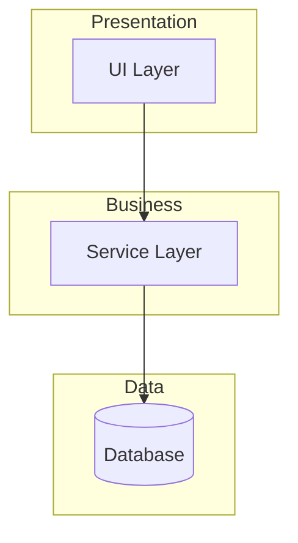

# 🔬 Project Architecture Research

> **Status**: ⚪ NOT INITIALIZED  
> **Last Updated**: {{DATE}}  
> **Researched By**: `ouroboros-researcher`

---

## 📁 Project Structure

```
{{project-root}}/
├── src/                # Source code
│   ├── components/     # {{Description}}
│   ├── services/       # {{Description}}
│   └── utils/          # {{Description}}
├── tests/              # Test files
├── docs/               # Documentation
└── config/             # Configuration files
```

---

## 🏗️ Architecture Overview

{{Describe the overall architecture pattern (e.g., MVC, Microservices, Monolith, Clean Architecture)}}



---

## 🛠️ Tech Stack

| Layer | Technology | Version | Config File |
|-------|------------|---------|-------------|
| Language | {{TypeScript/Python}} | {{version}} | `tsconfig.json` / `pyproject.toml` |
| Frontend | {{React/Vue/None}} | {{version}} | `package.json` |
| Backend | {{FastAPI/Express/None}} | {{version}} | `package.json` / `pyproject.toml` |
| Database | {{PostgreSQL/MongoDB/None}} | {{version}} | `docker-compose.yml` |
| Build Tool | {{Vite/Webpack/None}} | {{version}} | `vite.config.ts` |
| Package Manager | {{npm/pnpm/poetry}} | {{version}} | `package-lock.json` / `poetry.lock` |
| Test Framework | {{Vitest/Jest/Pytest}} | {{version}} | `vitest.config.ts` / `pytest.ini` |
| Linter | {{ESLint/Ruff}} | {{version}} | `.eslintrc` / `ruff.toml` |

---

## 📦 Key Components

| Component | File Path | Responsibility | Dependencies |
|-----------|-----------|----------------|--------------|
| Entry Point | `{{src/main.ts}}` | Application bootstrap | - |
| Config | `{{src/config/index.ts}}` | Environment configuration | - |
| Router | `{{src/router/index.ts}}` | Route definitions | Config |
| API Layer | `{{src/api/}}` | External API calls | Config |
| Data Layer | `{{src/db/}}` | Database operations | Config |
| Core Logic | `{{src/services/}}` | Business logic | API, Data |

---

## 🔗 Key Dependencies

| Dependency | Version | Purpose | Docs |
|------------|---------|---------|------|
| {{dependency1}} | {{version}} | {{purpose}} | {{URL}} |
| {{dependency2}} | {{version}} | {{purpose}} | {{URL}} |
| {{dependency3}} | {{version}} | {{purpose}} | {{URL}} |

---

## 🌐 Environment Setup

### Prerequisites

| Tool | Version | Installation |
|------|---------|--------------|
| Node.js | {{>=18}} | `nvm install 18` |
| Python | {{>=3.11}} | `pyenv install 3.11` |
| Docker | {{>=24}} | [Docker Desktop](https://docker.com) |

### Environment Variables

| Variable | Required | Default | Description |
|----------|----------|---------|-------------|
| `{{DATABASE_URL}}` | ✅ | - | Database connection string |
| `{{API_KEY}}` | ✅ | - | External API key |
| `{{DEBUG}}` | ❌ | `false` | Enable debug mode |

### Setup Steps

```bash
# 1. Clone repository
git clone {{repo-url}}
cd {{project-name}}

# 2. Install dependencies
{{npm install / poetry install}}

# 3. Setup environment
cp .env.example .env
# Edit .env with your values

# 4. Start development
{{npm run dev / poetry run python main.py}}
```

---

## 🚀 Common Commands

| Command | Purpose | Notes |
|---------|---------|-------|
| `{{npm run dev}}` | Start development server | Hot reload enabled |
| `{{npm run build}}` | Build for production | Output in `dist/` |
| `{{npm run test}}` | Run all tests | Add `--watch` for watch mode |
| `{{npm run lint}}` | Run linter | Add `--fix` to auto-fix |
| `{{npm run format}}` | Format code | Uses Prettier |
| `{{docker-compose up}}` | Start services | Database, Redis, etc. |

---

## 🔄 CI/CD Pipeline

| Stage | Trigger | Actions | Config |
|-------|---------|---------|--------|
| Lint | PR, Push | ESLint, Type check | `.github/workflows/ci.yml` |
| Test | PR, Push | Unit, Integration | `.github/workflows/ci.yml` |
| Build | Push to main | Docker build | `.github/workflows/build.yml` |
| Deploy | Tag v* | Deploy to prod | `.github/workflows/deploy.yml` |

---

## 📐 Design Patterns Detected

| Pattern | Location | Evidence |
|---------|----------|----------|
| {{Repository Pattern}} | `src/repositories/` | {{Data access abstraction}} |
| {{Service Layer}} | `src/services/` | {{Business logic separation}} |
| {{Dependency Injection}} | `src/container.ts` | {{IoC container}} |
| {{Observer Pattern}} | `src/events/` | {{Event emitter usage}} |

---

## ⚠️ Important Notes / Gotchas

<!-- ACTION REQUIRED: List any special patterns, conventions, or things to be aware of -->

| Area | Note | Impact |
|------|------|--------|
| {{Authentication}} | {{Uses JWT with refresh tokens}} | {{Check token expiry}} |
| {{Database}} | {{Uses soft deletes}} | {{Filter deleted records}} |
| {{API}} | {{Rate limited to 100 req/min}} | {{Implement retry logic}} |
| {{Testing}} | {{Requires Docker for integration tests}} | {{Run `docker-compose up -d` first}} |

---

## 📋 Recommended Reading Order

1. **Start here**: `{{README.md}}` — Project overview
2. **Configuration**: `{{src/config/}}` — Environment setup
3. **Entry point**: `{{src/main.ts}}` — Application bootstrap
4. **Core logic**: `{{src/services/}}` — Business logic
5. **API layer**: `{{src/api/}}` — External integrations

---

## Quality Self-Check

Before marking complete, verify:

- [ ] Tech stack has actual version numbers
- [ ] All key components have file paths
- [ ] Environment variables documented
- [ ] Common commands are accurate
- [ ] Design patterns have evidence
- [ ] Gotchas are project-specific
